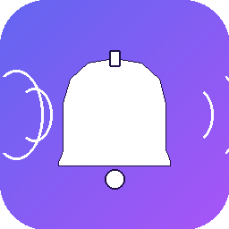
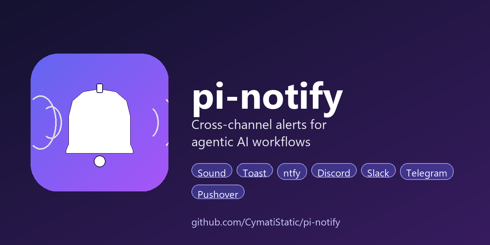

<div align="center">



# pi-pager

**Cross-channel alerts for agentic AI workflows.**
Sound. Toast. Phone. Watch. One-line call, seven delivery channels, zero babysitting.

[](./LICENSE)
[](https://learn.microsoft.com/en-us/powershell/)
[]()
[](https://github.com/CymatiStatic/pi-pager/actions/workflows/lint.yml)

</div>

---

## Why

When your coding agent (Pi, Claude Code, Cursor, Aider, Codex, etc.) needs approval or finishes a long build, you shouldn't have to babysit the terminal. **pi-pager** fires an instant alert across every channel you've enabled — local sound, desktop toast, phone, watch, Discord, Slack — with zero setup overhead and automatic per-project tagging.

```
Agent [full-stack-harness] Sprint 3 QA passed          ← rings on phone + desktop
Agent [spec-tator]          Approve new feature? (y/n) ← blocks on phone reply
Agent [pomofocus-webhook]   Deploy failed — check logs ← priority 5, bypasses DND
```

## Features

- PR Pending [](https://github.com/qualisero/awesome-pi-agent)
- 🔊 **Synchronous WAV sound** — reliable, no async cutoff
- 🪟 **Windows toast** via BurntToast, registered AppId (clicks don't spawn stray PowerShell windows)
- 📱 **Phone / watch push** via [ntfy.sh](https://ntfy.sh) — free, open-source, no account
- 📬 **Two-way inbox** — text the agent from your phone; background daemon caches to local log
- ⏳ **`-Wait` flag** — block until your phone replies (`yes`/`no` → exit code)
- 🏷️ **Auto project tagging** — walks up to find `.git`, prefixes every alert with repo name
- ⚙️ **Per-project overrides** via `.pi-pager.json` in any repo
- 💬 **Optional channels**: Discord, Slack, Telegram, Pushover
- 🚀 **Auto-start on login** (Windows), no daemon supervision needed
- 🐚 **Cross-platform** — `notify.ps1` (Windows) + `notify.sh` (macOS/Linux)

## Preview

<div align="center">

</div>

> **Note:** Live screenshots of the toast, phone push, and ntfy inbox coming soon — see [Roadmap](#roadmap). PRs with screenshots welcome.

---

## Install

### Windows — One-command installer (recommended)

```powershell
git clone https://github.com/CymatiStatic/pi-pager.git
cd pi-pager
powershell -ExecutionPolicy Bypass -File install.ps1
```

The installer:
1. Generates a random private ntfy topic (or use `-Topic "existing"` to preserve)
2. Creates `~/.pi-pager/` data dir with config
3. Installs [BurntToast](https://github.com/Windos/BurntToast) and registers the `PiAgent` AppId
4. Adds a Startup shortcut so the daemon auto-launches on login
5. Prints your topic name + ntfy app install links

### Windows — Scoop (coming soon)

```powershell
scoop bucket add pi-pager https://github.com/CymatiStatic/pi-pager
scoop install pi-pager
```
> *Scoop manifest is at `packaging/scoop/pi-pager.json`. Waiting on first tagged release to finalize the URL/hash.*

### Windows — PowerShell Gallery (coming soon)

```powershell
Install-Module -Name PiPager -Scope CurrentUser
# Then:
Send-PiPage -Type done -Message 'Build passed'
```
> *Module is ready at `module/`. Publish requires an NuGet API key — see [PUBLISHING.md](docs/PUBLISHING.md).*

### macOS — Homebrew (coming soon)

```bash
brew tap CymatiStatic/pi-pager
brew install pi-pager
```
> *Formula at `packaging/homebrew/pi-pager.rb`. Needs the release tarball SHA before first publish.*

### macOS / Linux — Manual

```bash
git clone https://github.com/CymatiStatic/pi-pager.git ~/.pi-pager-repo
ln -s ~/.pi-pager-repo/scripts/notify.sh /usr/local/bin/pi-pager
chmod +x ~/.pi-pager-repo/scripts/notify.sh
# Generate config:
mkdir -p ~/.pi-pager
cp ~/.pi-pager-repo/scripts/notify.config.example.json ~/.pi-pager/notify.config.json
# Edit ~/.pi-pager/notify.config.json and replace the topic placeholder
```

## Phone Setup

1. Install the **ntfy** app:
   - iOS: [App Store](https://apps.apple.com/us/app/ntfy/id1625396347)
   - Android: [Play Store](https://play.google.com/store/apps/details?id=io.heckel.ntfy) · [F-Droid](https://f-droid.org/packages/io.heckel.ntfy/)
2. Open the app → **Subscribe to topic** → paste the topic the installer printed.
3. Done — every alert now pings your phone and watch.

---

## Usage

```powershell
# Fire alerts (agent does this automatically — see Agent Integration)
pwsh -File scripts/notify.ps1 -Type input -Message "Deploy to prod?"
pwsh -File scripts/notify.ps1 -Type done  -Message "Build passed"
pwsh -File scripts/notify.ps1 -Type warn  -Message "Tests flaky"
pwsh -File scripts/notify.ps1 -Type error -Message "Deploy failed"

# Block until phone replies (-Wait), exit code = y/n
$reply = pwsh -File scripts/notify.ps1 -Type input -Message "Merge PR?" -Wait -TimeoutSec 60
echo "LASTEXITCODE=$LASTEXITCODE reply=$reply"
#   0 = yes/ok/approve, 1 = no/cancel/reject, 2 = timeout

# Read phone-sent messages
pwsh -File scripts/inbox.ps1                  # last 10 min
pwsh -File scripts/inbox.ps1 -Since 1h        # last hour
pwsh -File scripts/inbox.ps1 -IncludePi       # also show agent's outbound alerts
pwsh -File scripts/inbox.ps1 -Mark            # mark all as read (clear log)

# Daemon control
pwsh -File scripts/inbox-daemon.ps1 -Status
pwsh -File scripts/inbox-daemon.ps1 -Stop
```

### macOS / Linux

```bash
pi-pager --type done --message "Build passed"
pi-pager --type input --message "Deploy?" --wait --timeout 60
echo "exit=$?"
```

## Agent Integration

Drop-in prompt snippets in [`examples/agent-prompts/`](examples/agent-prompts/):

| Agent | File | Paste into |
|-------|------|------------|
| **Pi** | [`pi-SYSTEM.md`](examples/agent-prompts/pi-SYSTEM.md) | `~/.pi/agent/SYSTEM.md` |
| **Claude Code** | [`claude-code-CLAUDE.md`](examples/agent-prompts/claude-code-CLAUDE.md) | `~/CLAUDE.md` or project `CLAUDE.md` |
| **Cursor** | [`cursor-rules.md`](examples/agent-prompts/cursor-rules.md) | `.cursorrules` at repo root |

The snippet teaches the agent *when* to fire each alert type. Rule of thumb: **one fire per attention event**, never on every tool call.

## Alert Types

| Type | Windows sound | ntfy priority | When to fire |
|------|---------------|---------------|--------------|
| `input` | Windows Notify Messaging | 4 | Before asking user for approval |
| `done`  | tada.wav | 3 | Long task finished |
| `warn`  | Windows Notify | 3 | Non-blocking caution |
| `error` | Windows Critical Stop | 5 (bypass DND) | Blocker / needs human |

## Multi-Project: One Channel, Auto-Tagged

One topic handles every repo. Every alert is prefixed with the project name (walks up to find `.git`):

```
Agent [full-stack-harness] Sprint 3 QA passed
Agent [spec-tator]         Needs approval on spec
Agent [pomofocus-webhook]  Server crashed
```

One phone subscription, one Discord channel, zero config per project.

**Per-project override** (drop `.pi-pager.json` in a repo root — e.g., to send client work to a different Discord):

```json
{
  "project_name": "client-acme",
  "ntfy_topic": "pi-acme-abc123def456",
  "discord_webhook_url": "https://discord.com/api/webhooks/...",
  "discord_enabled": true
}
```

See [`examples/.pi-pager.json`](examples/.pi-pager.json).

## Two-Way Messaging

Pi → phone is one-way by default (outbound alerts only). To text the agent **from** your phone:

1. Open the ntfy app → your topic → send a message.
2. The background daemon catches it and appends to `~/.pi-pager/inbox.log`.
3. Ask the agent to run `/inbox` (or `Get-PiPagerInbox`).
4. Agent reads your message and acts on it.

### Routing to a Specific Instance (Multi-Project)

If you have multiple agent instances running across different repos, prefix your phone message to route it:

| You text from phone | Reaches |
|---------------------|---------|
| `harness: check deploy status` | Only the agent running in the `harness` repo |
| `[spec-tator] approve spec` | Only the agent in `spec-tator` |
| `pi-pager: rerun tests` | Only the agent in `pi-pager` |
| `check deploy` (no prefix) | **Broadcast** — all instances see it |

`/inbox` from inside a repo automatically filters to that project + broadcasts. Use `/inbox -All` to see everything across projects, or `/inbox -Project foo` to peek at another instance's mailbox.

With `-Wait`, only replies addressed to the waiting project (or broadcasts) unblock that specific call. So you can fire `-Wait` from `harness` and `spec-tator` simultaneously, then reply `harness: yes` to approve one without affecting the other.

With `-Wait`, the agent *blocks* until your phone replies — useful for remote approval:

```powershell
$answer = Send-PiPage -Type input -Message "Deploy to prod?" -Wait -TimeoutSec 300
# $LASTEXITCODE is 0 (yes/ok/approve), 1 (no/cancel/reject), or 2 (timeout)
```

## Channels

| Channel | Default | Config field | Notes |
|---------|---------|--------------|-------|
| Local WAV sound | ✅ | `sounds.*.wav` | Windows + macOS + Linux |
| Windows toast (BurntToast) | ✅ | `toast.enabled` | Windows only |
| macOS notification | ✅ | (automatic) | via `osascript` |
| Linux notification | ✅ | (automatic) | via `notify-send` |
| **ntfy** (phone / watch) | ✅ | `ntfy.enabled` | Free, no account |
| Discord webhook | ❌ | `discord.webhook_url` | Free, instant |
| Slack webhook | ❌ | `slack.webhook_url` | Free |
| Telegram bot | ❌ | `telegram.bot_token` + `chat_id` | Free |
| Pushover | ❌ | `pushover.app_token` + `user_key` | $5 one-time, most reliable |

Edit `~/.pi-pager/notify.config.json` to enable any of the opt-in channels.

### Enabling Discord
1. Server Settings → Integrations → Webhooks → **New Webhook**
2. Pick a channel, copy URL
3. Set `discord.enabled: true` and paste URL into `discord.webhook_url`

### Enabling Telegram
1. Chat [@BotFather](https://t.me/BotFather) → `/newbot` → save the token
2. Message your new bot once (any text)
3. `curl https://api.telegram.org/bot<TOKEN>/getUpdates` → find `chat.id`
4. Set `telegram.enabled: true`, paste token + chat id

### Enabling Pushover
1. Create an app at [pushover.net/apps/build](https://pushover.net/apps/build) → copy API token
2. Your user key is on the [dashboard](https://pushover.net)
3. Set `pushover.enabled: true` and paste both

## Self-Hosted ntfy (Optional Privacy Upgrade)

By default, messages go through `https://ntfy.sh` (the free public relay). The topic name is your "password" — anyone who guesses it can send you notifications. For true privacy, self-host ntfy in Docker:

```yaml
# docker-compose.yml
services:
  ntfy:
    image: binwiederhier/ntfy
    command: serve
    volumes:
      - ./cache:/var/cache/ntfy
    ports:
      - "9191:80"
```

Then update `ntfy.server` in your config:

```json
"ntfy": { "enabled": true, "server": "https://ntfy.mydomain.com", "topic": "..." }
```

See [ntfy self-hosting docs](https://docs.ntfy.sh/install/).

---

## Portability to Another Machine

1. `git clone https://github.com/CymatiStatic/pi-pager.git`
2. `powershell -File install.ps1 -Topic "your-existing-topic"` ← preserves your phone subscription
3. Done. Second machine streams the same topic; phone gets alerts from both machines.

## Architecture

```
┌──────────────────┐      ┌──────────────────────────┐
│   AI Agent       │─────>│ scripts/notify.ps1        │
│  (Pi, Claude     │      │                           │
│   Code, Cursor)  │      │  ┌──────────────────────┐ │
└──────────────────┘      │  │ 1. WAV (sync)        │ │
                          │  │ 2. Toast             │ │
                          │  │ 3. ntfy POST         │─┼──> phone / watch
                          │  │ 4. Discord           │─┼──> Discord
                          │  │ 5. Slack             │─┼──> Slack
                          │  │ 6. Telegram          │─┼──> Telegram
                          │  │ 7. Pushover          │─┼──> Pushover
                          │  └──────────────────────┘ │
                          └──────────────────────────┘

┌──────────────────┐      ┌──────────────────────────┐
│  Your phone      │─────>│ ntfy.sh (topic stream)   │
│  (ntfy app)      │      └────────────┬─────────────┘
└──────────────────┘                   │
                                       ▼
                          ┌──────────────────────────┐
                          │ inbox-daemon.ps1         │
                          │  (streams NDJSON, appends)│
                          └────────────┬─────────────┘
                                       ▼
                          ┌──────────────────────────┐
                          │ ~/.pi-pager/inbox.log   │
                          │  (read via /inbox)       │
                          └──────────────────────────┘
```

## Known Issues

- **Toast click opens random PowerShell window.** Fixed in install.ps1 by registering the `PiAgent` AppId via BurntToast's `New-BTShortcut`. If you see this, run `install.ps1` again.
- **First `SystemSounds.Play()` call silent.** We use `Media.SoundPlayer.PlaySync()` instead — always audible, blocks correctly.
- **`Invoke-WebRequest` mangles NDJSON on some PS 5.1 systems.** We shell out to `curl.exe` (built into Windows 10+) for HTTP.
- **ntfy `poll=1` returns only messages still in cache.** Free tier caches ~12h. The background daemon mitigates this by streaming continuously.
- **No built-in auth on public ntfy.sh.** Topics are security-through-obscurity. For real auth, self-host or use ntfy Pro.
- **macOS / Linux `-Wait` polls (not streams).** The bash script uses 2-second polling; the daemon (PowerShell-only today) streams. Cross-platform daemon is on the roadmap.
- **Unicode in titles from git-bash terminal.** `curl.exe` called from MSYS-bash sometimes mangles em-dash / bullet characters. We use ASCII `[brackets]` instead.

## Troubleshooting

| Symptom | Fix |
|---------|-----|
| No sound plays | Verify `Media.SoundPlayer` works: `powershell -NoProfile -Command "(New-Object Media.SoundPlayer 'C:\Windows\Media\tada.wav').PlaySync()"` |
| No toast shown | Check BurntToast: `Get-Module -ListAvailable BurntToast` — reinstall via `install.ps1` |
| No phone push | `curl https://ntfy.sh/YOUR_TOPIC/json?poll=1&since=10m` — if empty, topic mismatch |
| Inbox empty despite messages | Check daemon: `pwsh -File scripts/inbox-daemon.ps1 -Status`. If dead, relaunch via the Startup shortcut or run install.ps1 |
| `curl.exe: command not found` | Windows 10 1803+ ships it. On older Windows, install [curl](https://curl.se/windows/) or Git for Windows |
| PowerShell says "cannot be loaded because running scripts is disabled" | Use `-ExecutionPolicy Bypass` flag or `Set-ExecutionPolicy RemoteSigned -Scope CurrentUser` |
| Toast click still opens PowerShell | Run `install.ps1` again — it re-registers the `PiAgent` AppId via `New-BTShortcut` |

## Uninstall

```powershell
powershell -ExecutionPolicy Bypass -File uninstall.ps1
# optional: Uninstall-Module BurntToast
```

Removes: Startup shortcut, `~/.pi-pager/` data dir, running daemon.
Keeps: BurntToast module (shared with other apps), cloned repo.

## Roadmap

- [x] Windows support (v0.1.0)
- [x] Cross-platform `notify.sh` (v0.2.0)
- [x] Telegram + Pushover channels (v0.2.0)
- [x] `-Wait` for phone approval (v0.2.0)
- [x] PowerShell module scaffold (v0.2.0)
- [x] Scoop + Homebrew packaging (v0.2.0)
- [ ] Real screenshots / demo GIF
- [ ] PSGallery publish (needs API key)
- [ ] Homebrew tap repo (CymatiStatic/homebrew-pi-pager)
- [ ] macOS / Linux background daemon
- [ ] Apprise integration (80+ services)
- [ ] Home Assistant integration
- [ ] Web dashboard for inbox history
- [ ] VS Code extension (fire pi-pager on task completion)

## Contributing

See [CONTRIBUTING.md](CONTRIBUTING.md). Particularly interested in:
- macOS / Linux daemon parity
- More agent prompt templates (Aider, Continue, Zed, Codex)
- Screenshots / demo GIF
- Translations for alert messages

## License

MIT — see [LICENSE](LICENSE).

---

<div align="center">
Made with 🔔 by <a href="https://github.com/CymatiStatic">CymatiStatic</a>
</div>
